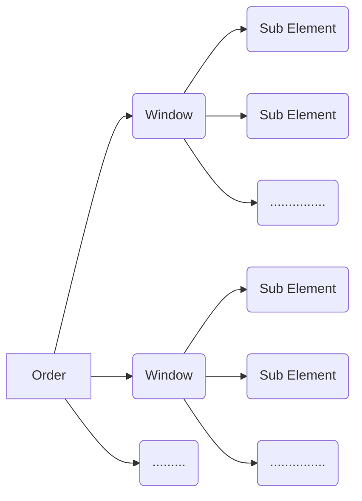

# Intus Project

This is a Demo Project to show case .Net Platform skill. 
Here .Net 6 along with Blazor is used, with practices includes State Management, Layered Architecture, BLL, DAL Projects, DTO, Validation, Async Programming, Navigation, Dependency Injection etc.

**Server Side:**  .Net 6 Web API with Entity Framework Code First Approach

**Client Side:**  Blazor WebAssembly App

# How To Run

Go to the **appsettings.json** file in **IntusProject.Server**

Change the DB Connection string in the value section for the key **IntusConnection**

Right Click on the **IntusProject.Server** project and select **Set as Startup Project**

**Run** From VS Studio.

## Project Explanation
### Data Architecture
This is the Data architecture that is being used. This represent the Relation of the Entities:

### Pages
**Note**: All the data for all the pages is being fetched once and stored in the page specific state. So we can navigate through the application with state data. 
To refresh the State or fetch data again from DB, Page can be hard reloaded or **Refresh** button can be used correspondent to that particular page to fetch the data
#### Order Page:
Here, we have list of all the existing Orders.
We can Click on the **Window** Button. It will take to the Window Page for that particular Order.

A new Order can be created by clicking the **Add Order** button

The input view model has Validation implemented

After submitting the Modal Form we will see the newly added Order in the List.

We can add as many order as we want.
But this is only being saved in the State. That is why a new **Save State** button appears, the ID is 0 and no Windows button since this data does not exist in the DB yet.
We can **Remove** it or **Refresh** the page again to reset the State.
We can also Remove existing Data. Although this will only remove it from the State.

After clicking the **Save State** button. All the changes of the State will be saved in DB. This includes, Deleting the rows that has been **Removed**. and Adding the new Data that has been **Added**

After saving the state the **Save State** button disappears. We can now see the newly generated ID for that new row and also the **Window** button appears.
#### Window Page & SubElement Page:
Window Page & SubElement page has the same feature/functionality like the Order page.

**Go Back** button can be used to navigate through the Window and SubElement Pages since there are no Menu button for them we can only navigate it through existing Order or Window.

### Limitation and Improvements
In **Window Page** we have a property **"TotalSubElements"** represent the count of the Sub Element data in a window. If we navigate to the SubElement page and add or remove any data from State only (not DB). It will not be reflected in that property. It will represent the data from DB only. After Adding a new SubElement, refresh is needed to see the changes. This can be solved by fetching the SubElement page state data in Window Page.

There are no **Edit** functionality. The existing Modal can be used to edit the data.
Since the server backend code takes all the data list and supports only adding and removing. Editable option need to be adjusted there. This can be done by Updating all the data that is being sent to the backend. Although this is a easy option but its not feasible and a bad option in terms of large data sets. We can keep track of the edited rows in the state. and pass the IDs to the backend so it will update only that IDs.

Some codebases, in terms of each entity or pages are identical and repeated. It can be made into a generic methods that will work for all Types or interface can be used or a base class with inherited override methods can be used.

